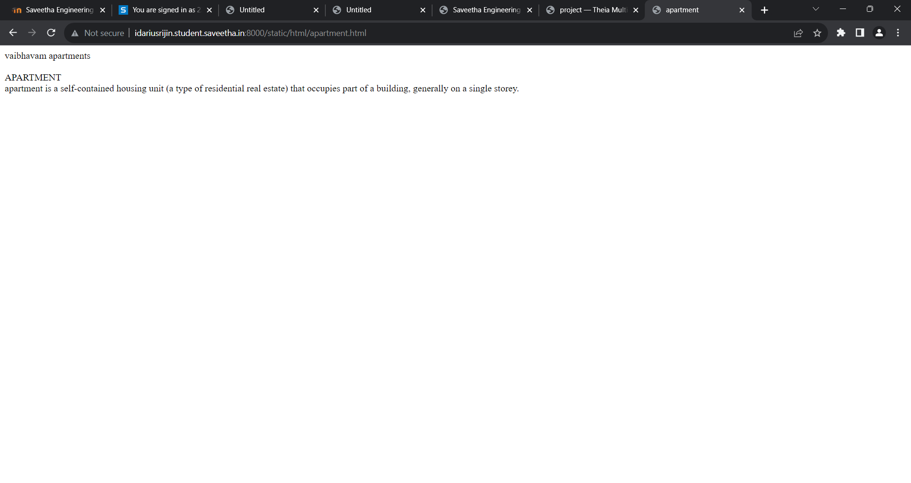
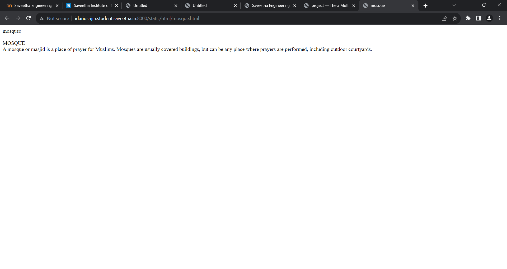
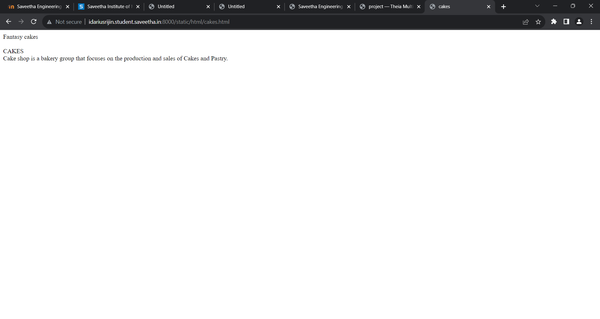
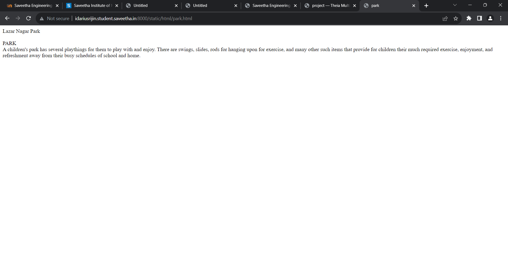
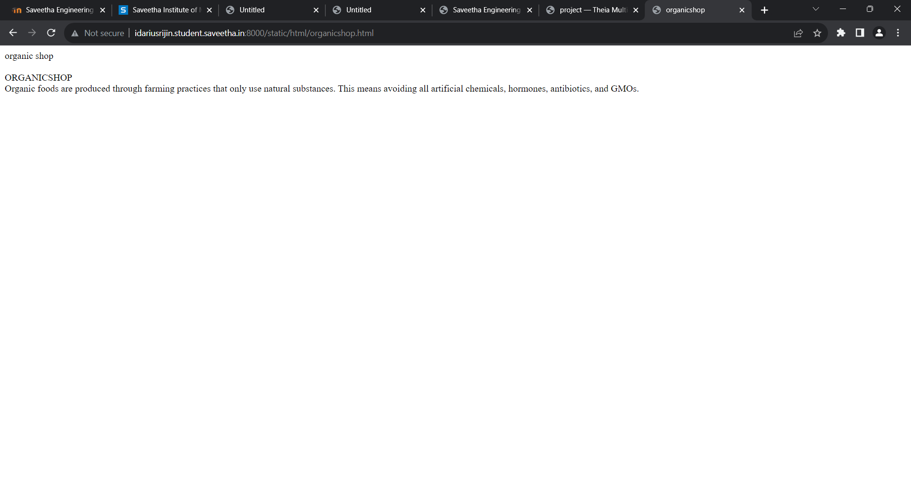

# Places Around Me
## AIM:
To develop a website to display details about the places around my house.

## Design Steps:

### Step 1:
Write your own steps here.
### Step 2:

## Code:
<!DOCTYPE html>
<html>
<head>
    <title>places around me</title>
</head>
<body>

<map name="image-maps-2023-07-25-035913" id="ImageMapsCom-image-maps-2023-07-25-035913">
<area  alt="" title="cakes" href="cakes.html" shape="rect" coords="264,430,328,486" style="outline:none;" target="_self"     />
<area  alt="" title="apartment" href="apartment.html" shape="rect" coords="759,6,833,77" style="outline:none;" target="_self"     />
<area  alt="" title="organicshop" href="organicshop.html" shape="rect" coords="399,412,473,483" style="outline:none;" target="_self"     />
<area  alt="" title="mosque" href="mosque.html" shape="rect" coords="998,327,1072,398" style="outline:none;" target="_self"     />
<area  alt="" title="park" href="park.html" shape="rect" coords="245,21,319,92" style="outline:none;" target="_self"     />
<area shape="rect" coords="1361,712,1363,714" alt="Image Map" style="outline:none;" title="Image Map" href="https://www.image-maps.com/" />
</map>    
</body>
</html>

## Output:

## Result:
The program is executed successfully.